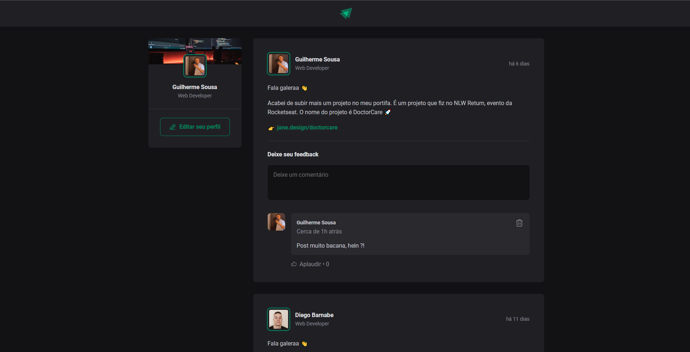

<h1 align="center"> Ignite Feed </h1>

Um feed de rede social, totalmente funcional e dinâmico!

  <a href="#-tecnologias">Tecnologias</a>&nbsp;&nbsp;&nbsp;|&nbsp;&nbsp;&nbsp;
  <a href="#-projeto">Projeto</a>&nbsp;&nbsp;&nbsp;|&nbsp;&nbsp;&nbsp;
  <a href="#-layout">Layout</a>&nbsp;&nbsp;&nbsp;|&nbsp;&nbsp;&nbsp;
  <a href="#memo-licença">Licença</a>

  

 

  

## 🚀 Tecnologias

Esse projeto foi desenvolvido com as seguintes tecnologias:

- HTML e CSS
- JavaScript e JSON
- ReactJS e TypeScript
- [Node e NPM](https://nodejs.org/)
- [Vite](https://vitejs.dev/)

## 💻 Projeto

O Ignite Feed é um componente que simula o feed de uma rede social, onde é possível adicionar comentários, excluir e aplaudir os posts.

## 🔖 Layout

Você pode visualizar o layout do projeto através [DESSE LINK](https://www.figma.com/file/TkVvRLD1fWzGKpvbk9mChk/Ignite-Feed-(Community)?type=design&node-id=0-1&mode=design&t=qSQgWYBJtNazXXU6-0). É necessário ter conta no [Figma](https://figma.com) para acessá-lo.

## :memo: Licença
